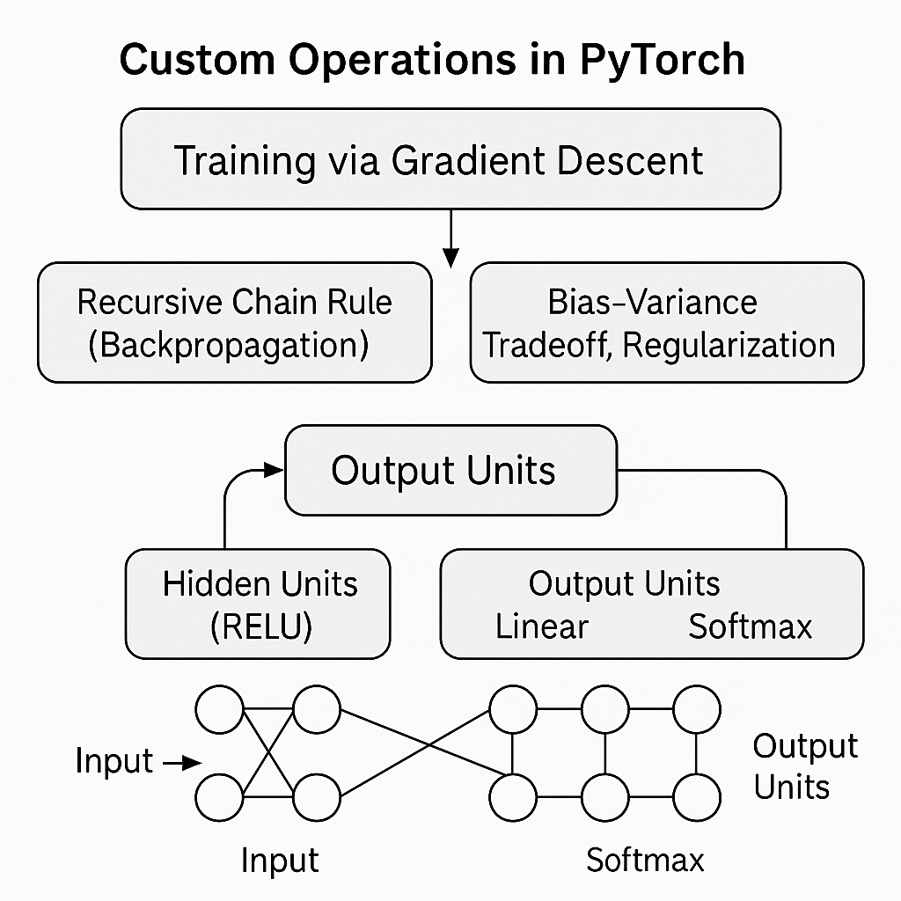

# Implement custom operations in PyTorch by using deep learning via gradient descent;

1. recursive chain rule (backpropagation)
2. bias-variance tradeoff
3. regularization
4. output units: linear, softmax; hidden units: tanh, RELU.

# Custom Operations in PyTorch

This project demonstrates how to **implement custom operations in PyTorch** and train a small neural network using them.  
It covers important deep learning concepts like:

- Implementing **custom forward & backward passes** (autograd)
- Training with **gradient descent (backpropagation)**
- Exploring **bias–variance tradeoff**
- Applying **regularization (L2 weight decay)**
- Using different **output units** (Linear / Softmax)
- Using different **hidden units** (ReLU / Tanh)

---

## Dependencies

1. torch – Core PyTorch library (tensors, autograd, training)
2. torchvision – Datasets & transforms (MNIST)
3. matplotlib – Plotting results (loss/accuracy curves)
4. notebook – (Optional) Run in Jupyter Notebooks

Install manually if you don’t want to use requirements.txt:

```
    pip install torch torchvision matplotlib notebook
```

## Experiments to Try

2. Regularization

   - Modify weight_decay in the training function:

   ```
       train(model, loader, lr=0.1, epochs=5, weight_decay=0.0)   # no regularization
       train(model, loader, lr=0.1, epochs=5, weight_decay=1e-3)  # with L2 regularization
   ```

3. Activation Functions

   - Switch between ReLU and Tanh:

   ```
       model = CustomMLP(hidden=64, act="relu")
       model = CustomMLP(hidden=64, act="tanh")
   ```


